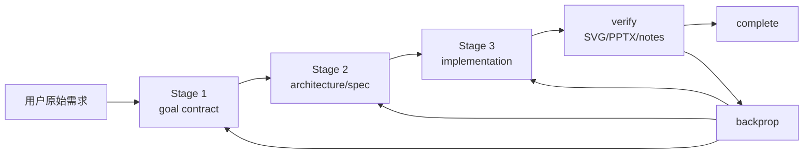
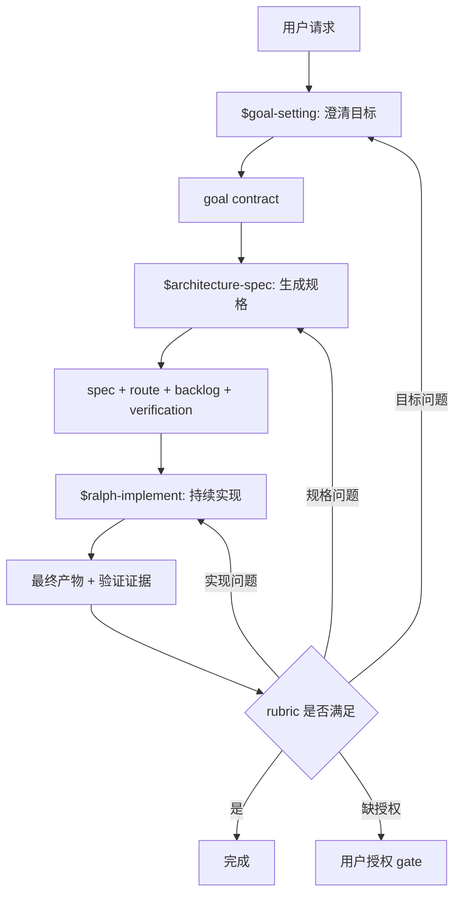
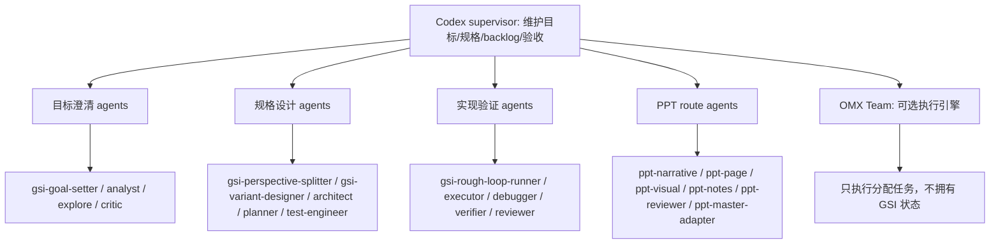

# GSI 设计梳理：Skill、Agent、Workflow

## 这份文档要回答什么

- 这份文档只回答 GSI 这次到底搭了什么。
  - 加了哪些 skill。
  - 接了哪些 agent。
  - 三阶段 workflow 怎么跑。
  - PPT 为什么只是一个 route，而不是单独 workflow。
  - 如果别人觉得流程不合适，应该从哪里改。
- 这份文档不做代码 diff 走读。
  - 不按文件逐个解释实现细节。
  - 不把重点放在构建、npm、代理或发布过程。
  - 不把 GSI 讲成 PPT 工具。

## 一句话结论

- GSI 是一个“先澄清目标、再定规格、最后持续实现和验证”的任务治理流程。
  - 用户不需要一开始选 PPT、代码、报告或研究模式。
  - 用户只需要进入 `$gsi`，GSI 会先确认目标，再在规格阶段识别产物类型，最后分配合适的 agent 和工具去完成。
  - 失败时不是笼统“再优化”，而是判断应该回到目标、规格，还是实现阶段修。

## 这次实际搭了哪些东西

- 这次新增和调整的是一组 GSI skills。
  - `$gsi` 是总入口。
    - 它负责把三阶段串起来。
    - 它支持 `$gsi <task>` 自动跑完整流程。
    - 它也支持 `$gsi --team=auto|manual|off <task>` 声明 Team 使用策略。
    - 落地文件：`skills/gsi/SKILL.md` 和 `plugins/oh-my-codex/skills/gsi/SKILL.md`。
  - `$goal-setting` 是需求/目标阶段。
    - 它负责把用户的粗略想法变成目标契约。
    - 它的重点不是总结用户，而是通过多轮确认把目标、非目标、验收标准和授权边界问清楚。
    - 落地文件：`skills/goal-setting/SKILL.md` 和 `plugins/oh-my-codex/skills/goal-setting/SKILL.md`。
  - `$architecture-spec` 是架构/规格阶段。
    - 它负责把目标契约变成可执行的规格。
    - 它在这一阶段识别产物类型，并决定后面应该用哪些 agent 和工具。
    - PPT 的 Eight Confirmations 也放在这里决定，因为它们是设计规格，不是实现细节。
    - 落地文件：`skills/architecture-spec/SKILL.md` 和 `plugins/oh-my-codex/skills/architecture-spec/SKILL.md`。
  - `$ralph-implement` 是持续实现阶段。
    - 它负责消费目标和规格，然后一直做、一直验、一直推进 backlog。
    - 它不只做第一个任务项；如果当前项完成且下一个任务仍在批准范围内，它继续做下一个。
    - 它可以直接做，也可以调 native child agents，也可以按 `team_policy` 调 OMX Team。
    - 落地文件：`skills/ralph-implement/SKILL.md` 和 `plugins/oh-my-codex/skills/ralph-implement/SKILL.md`。
  - `$gsi-ppt` 只保留为兼容说明。
    - 它不再是独立 PPT workflow。
    - 它告诉用户 PPT 也应该走通用 `$gsi -> goal-setting -> architecture-spec -> ralph-implement`。
    - 落地文件：`skills/gsi-ppt/SKILL.md`。
- 这次接入了一组 GSI 专用 agent。
  - `gsi-goal-setter` 负责冻结目标契约。
  - `gsi-perspective-splitter` 负责把目标拆成用户、受众、实现者、评审者、维护者等视角。
  - `gsi-variant-designer` 负责设计 champion/challenger 方案，而不是只给一个默认方案。
  - `gsi-rough-loop-runner` 负责在实现阶段推进可验证的执行循环。
  - `gsi-backprop-critic` 负责判断失败应该回到哪个阶段。
  - 这些 agent 的项目级配置在 `.omx/agents/gsi-*.toml`。
- 这次接入了一组 PPT route agent。
  - `ppt-intent-classifier` 判断一个任务是不是 PPT/deck，并提取 PPT 所需目标信息。
  - `ppt-narrative-architect` 负责 deck 的论证主线。
  - `ppt-page-planner` 负责每页的目的、内容边界和验收点。
  - `ppt-visual-director` 负责视觉方向，但不替代 `ppt-master`。
  - `ppt-speaker-notes-planner` 负责区分页面可见文字和讲稿内容。
  - `ppt-reviewer` 负责从叙事、可读性、视觉一致性、可编辑性和证据完整度审查 deck。
  - `ppt-master-adapter` 负责把 GSI 的 goal/spec 交给 `ppt-master`，并收集 PPTX 完成证据。
  - 这些 agent 的项目级配置在 `.omx/agents/ppt-*.toml`。
- 这次复用了 OMC 已有通用 agent。
  - goal-setting 主要复用 `analyst`、`explore`、`researcher`、`critic`、`scholastic`。
  - architecture-spec 主要复用 `architect`、`planner`、`test-engineer`、`dependency-expert`、`designer`、`writer`、`researcher`、`vision`、`critic`。
  - ralph-implement 主要复用 `executor`、`debugger`、`test-engineer`、`verifier`、`architect`、`code-reviewer`、`code-simplifier`、`git-master`、`team-executor`。
  - 复用规则是“需要谁才挂谁”，不是默认把所有 agent 都拉进来。
- 这次补了 PPT master 依赖桥。
  - `skills/ralph-implement/scripts/ensure-ppt-master-skill.sh` 用来解析或拉取 `ppt-master` skill。
  - PPT 实现必须通过这个 helper 找到 `ppt-master`。
  - 如果找不到依赖，流程要明确阻塞，而不是换一个普通 PPT 生成器糊过去。
- 这次加了契约测试来锁住设计。
  - 测试文件是 `src/hooks/__tests__/gsi-ppt-skill-contract.test.ts`。
  - 它检查三阶段、outline 输出、deep-interview 复用、agent 挂载、Team policy、PPT master 依赖、Eight Confirmations 分层等关键规则。

## Skill 是怎么设计的

- `$gsi` 的设计目标是做总控，而不是做具体产物。
  - 它接收用户任务。
  - 它决定走自动模式还是手动阶段模式。
  - 它监督 `$goal-setting`、`$architecture-spec`、`$ralph-implement` 的交接。
  - 它记录当前 phase、handoff artifacts、backlog、verification、backprop 等运行状态。
  - 它的核心判断是：什么时候可以进入下一阶段，什么时候必须回传。
- `$goal-setting` 的设计目标是把需求问清楚。
  - 它解决的问题是：AI 很容易过早开始做东西，但做出来的不是用户真正想要的。
  - 它复用 `$deep-interview` 的机制。
    - 先检查项目里已经能发现的信息。
    - 每轮只问一个最关键的问题。
    - 每轮回答后重新判断 ambiguity。
    - 优先问目标、受众、边界、非目标、验收标准，而不是先问实现细节。
    - 至少做一次 pressure pass，用反问或 tradeoff 检查用户前面的选择是否稳定。
  - 它的输出不是聊天记录，而是 goal contract。
    - 用户到底要什么。
    - 谁会使用或评审产物。
    - 什么算完成。
    - 什么明确不做。
    - agent 可以自己决定什么。
    - 什么必须回到用户确认。
  - 它通过后才能进入 `$architecture-spec`。
- `$architecture-spec` 的设计目标是把目标翻译成可执行规格。
  - 它解决的问题是：目标清楚不等于能直接开干，中间还需要视角、方案、验证和执行计划。
  - 它会做四件事。
    - 识别产物类型：PPT、代码、报告、研究材料等。
    - 拆 perspective：用户视角、受众视角、实现视角、评审视角、维护视角。
    - 设计方案：至少有 champion 方案和 challenger 方案，并说明什么时候 challenger 会赢。
    - 写实施规格：backlog、验收方式、验证命令或检查方式、需要的 agent、Team policy。
  - 它的输出是 architecture/spec。
    - 后续实现阶段必须消费这份规格。
    - 如果规格没写清楚，Stage 3 不应该硬做，而应该回传到 Stage 2。
- `$ralph-implement` 的设计目标是持续完成，而不是一次尝试。
  - 它解决的问题是：很多任务不是“做一件事就完”，而是做完一个 item、验证、再继续下一个 item。
  - 它会按 backlog 循环。
    - 选择下一个 item。
    - 决定直接做、派 child agent，还是调 Team。
    - 收集实现证据。
    - 进入验证。
    - 如果失败，判断是在本阶段修，还是回到 spec/goal。
    - 如果通过，继续下一个批准过的 item。
  - 它的输出是 implementation record。
    - 做了哪些 item。
    - 用了哪些 agent。
    - 产生了哪些文件。
    - 跑了哪些测试或检查。
    - 哪些问题被 backprop。
    - 最终产物在哪里。

## Agent 是怎么设计的

- Codex supervisor 是主位。
  - 所有 child agents、PPT agents、Team workers 都只是执行或审查某个边界清楚的子任务。
  - Codex supervisor 负责维护目标、规格、backlog、验证结果和最终判断。
  - 子 agent 不能自己扩大范围，也不能自己宣布整个 GSI 完成。
- Agent 按阶段挂载。
  - 需求阶段用能澄清目标的 agent。
    - `gsi-goal-setter` 负责最终 goal contract。
    - `analyst` 找需求缺口和验收标准。
    - `explore` 先查项目事实，减少无意义提问。
    - `critic` 检查假设、非目标和授权边界。
  - 规格阶段用能设计结构的 agent。
    - `gsi-perspective-splitter` 拆视角。
    - `gsi-variant-designer` 做方案变体。
    - `architect` 和 `planner` 把方案变成可执行结构。
    - `test-engineer` 定义验证方式。
    - `gsi-backprop-critic` 提前定义失败应该怎么归因。
  - 实现阶段用能执行、诊断和验证的 agent。
    - `executor` 做实现。
    - `debugger` 查失败原因。
    - `test-engineer` 补测试或验证策略。
    - `verifier` 独立检查完成证据。
    - `code-reviewer` 和 `architect` 在风险较高时做审查。
  - PPT route 用专门 deck agents。
    - narrative、page、visual、notes、review、ppt-master adapter 各自负责一个子问题。
    - 这些 agent 只在任务被识别为 PPT/deck 后使用。
- Agent 挂载有一个简单原则。
  - 如果这个 agent 的输出会改变 goal、spec、implementation 或 verification，就可以挂。
  - 如果它只是重复别人的话，不应该挂。

## Workflow 是怎么跑的

- 手动模式适合逐阶段审阅。
  - 用户先调用 `$goal-setting`。
  - 确认 goal contract 没问题后，再调用 `$architecture-spec`。
  - 确认 spec/backlog/verification 没问题后，再调用 `$ralph-implement`。
  - 这种模式适合需求复杂、用户想逐步批准的任务。
- 自动模式适合让 GSI 自己推进。
  - 用户调用 `$gsi <task>`。
  - GSI 自动进入 goal-setting。
  - goal gate 通过后自动进入 architecture-spec。
  - spec gate 通过后自动进入 ralph-implement。
  - 每个 implementation item 都必须验证。
  - 验证通过就继续下一个 approved backlog item。
  - 验证失败就进入 backprop 判断。
- 每一轮的输入和输出是固定的。
  - `$goal-setting`
    - 输入：用户请求、可发现的项目上下文、必要的用户回答。
    - 输出：goal contract。
    - 通过条件：目标、受众、rubric、non-goals、授权边界足够清楚。
  - `$architecture-spec`
    - 输入：goal contract。
    - 输出：architecture/spec、artifact route、agent route、implementation backlog、verification plan、team policy。
    - 通过条件：实现阶段能不依赖聊天记忆直接执行。
  - `$ralph-implement`
    - 输入：goal contract、architecture/spec、backlog、verification plan。
    - 输出：implementation record、最终产物、验证证据、backprop ledger。
    - 通过条件：required backlog 完成、rubric 满足、验证证据干净。
- Backprop 负责决定失败回到哪里。
  - 目标错，回 `$goal-setting`。
  - 规格错，回 `$architecture-spec`。
  - 实现错，留在 `$ralph-implement` 修。
  - 缺用户授权，停在 user authority gate。
- Team 是实现阶段的可选执行引擎。
  - `team_policy: auto`
    - GSI 可以在条件满足时自动启动或推荐 Team。
    - 前提是任务能拆成独立 lane，文件边界明确，runtime 可用，Codex 能监控 ACK/status/evidence。
  - `team_policy: manual`
    - GSI 只给 Team launch hint，不自动启动。
  - `team_policy: off`
    - GSI 不调用 Team，只用 direct work 或 native child agents。
  - 无论哪种策略，Team 都不拥有 GSI 状态。

## PPT route 是怎么接进去的

- PPT route 不在入口处分叉。
  - 用户不用调用 `$gsi-ppt`。
  - 用户说“做 PPT、deck、slides、PowerPoint、ppt-master”等，goal/spec 阶段会识别这是 presentation artifact。
- PPT 的设计决策放在 `$architecture-spec`。
  - `ppt-master` 的 Eight Confirmations 是规格决策。
    - Canvas format。
    - Page count range。
    - Target audience and use case。
    - Style objective。
    - Color scheme。
    - Icon library choice。
    - Typography plan。
    - Image usage policy。
  - Stage 2 决定这些问题后，Stage 3 不应该重复问。
- PPT 的真实生成放在 `$ralph-implement`。
  - Stage 3 先用 `ensure-ppt-master-skill.sh` 找到 `ppt-master`。
  - 然后读取 `ppt-master/SKILL.md`。
  - 然后通过 `uv run` 调 `ppt-master` 脚本执行。
  - 最终完成标准是有真实可编辑的 `exports/*.pptx`。

## 例子：这次 PPT 任务按 GSI 三阶段怎么跑

- 这个例子不是讲“做了哪些文件”，而是讲同一个 PPT 任务在 GSI 结构下每一阶段应该怎么判断。
  - 它要能和上面的 `Workflow 图` 对上。
  - 它也要能和“三阶段 V 模型”对上：左侧先收敛目标和规格，右侧执行后用验证结果反向归因。
  - 所以这里按阶段复制一遍本次任务的 goal、spec、implementation 逻辑。

- 和 `Workflow 图` 的节点对齐。
  - 用户请求进入 GSI。
    - 本次请求是“给上级做 GSI/OMX 增量汇报 PPT”。
    - 这一层还不判断页数、配色或 `ppt-master`，只识别这是一个需要治理的复杂产物请求。
  - `$goal-setting` 负责澄清目标。
    - 本次要澄清的是“重点不是实现清单，而是 GSI 增量逻辑”。
    - 这一阶段冻结上级受众、增量重点、非目标和完成标准。
    - 它的输出是 Stage 1 产物：goal contract。
  - `$architecture-spec` 负责生成规格。
    - 本次要设计论点链、页数、叙事顺序、PPT route 和 `ppt-master` Eight Confirmations。
    - 这一阶段产出 presentation route、9 页 plan、`ppt-master` 规格、verification plan 和 backprop rules。
    - 它的输出是 Stage 2 产物：spec + route + backlog + verification。
  - `$ralph-implement` 负责持续实现。
    - 本次按 spec 生成 `ppt-master` 项目、SVG、notes 和 PPTX。
    - 它不重新决定“要几页、什么风格、面向谁”，只消费 Stage 2 的规格。
    - 它的输出是 Stage 3 产物：最终产物 + 验证证据。
  - `rubric 是否满足` 负责验收。
    - 本次验收的是是否讲清 GSI 三层 V、OMX 区别、动态加载、边界和决策请求。
    - 如果满足，就进入 complete。
    - 如果不满足，先判断失败归因。
  - 失败回传不是笼统返工。
    - 如果是字体 drift、长句 warning、PPTX 导出问题，属于实现问题，回 `$ralph-implement` 修。
    - 如果是 Eight Confirmations 放错层、叙事视角不对、页数结构不支撑论点，属于规格问题，回 `$architecture-spec`。
    - 如果是听众、真实意图、非目标或完成标准判断错，属于目标问题，回 `$goal-setting`。

- 和三阶段 V 模型的对应关系。
  - 左上是“为什么做”。
    - 对应 Stage 1 goal。
    - 本次问题是：上级到底要听什么，什么不是重点。
    - 本次产物是 `Source Contract`。
  - 左下是“怎么才算做对”。
    - 对应 Stage 2 spec。
    - 本次问题是：论点链、页数、叙事、视觉和验证计划怎么定。
    - 本次产物是 `Deck Narrative`、slide plan、`design_spec.md`、`spec_lock.md`。
  - 右下是“按规格执行”。
    - 对应 Stage 3 implement。
    - 本次问题是：怎么把 spec 交给 `ppt-master` 并逐项生成。
    - 本次产物是 `svg_output/`、`notes/`、`exports/*.pptx`。
  - 右上是“验收和回传”。
    - 对应 verify/backprop。
    - 本次问题是：是否满足 rubric；失败应回目标、规格还是实现。
    - 本次证据是 SVG checker、PPTX package check 和下面的 backprop 归因树。

### Stage 1：本次 goal contract 应该长什么样

- Stage 1 要回答“到底要做什么”，不是回答“怎么做 PPT”。
  - 用户原话的核心不是“生成一个 PPT”。
  - 核心是“给上级讲 GSI/OMX 的能力增量”。
  - 所以 Stage 1 先把目标冻结，避免后面变成代码 diff、工具介绍或普通汇报模板。
- 本次 Stage 1 可以复制成这样的 goal contract。
  - `user_words`
    - “我需要给上级。”
    - “重点不在于实现了什么，在于增量。”
    - “比如 GSI 这个三层 V 架构、和原来 OMX 的区别、以及动态运行时加载 skill。”
  - `true_intent`
    - 用 PPT 解释 GSI 作为复杂任务治理模型的价值。
    - 让上级判断这套结构是否值得继续作为 OMX 的下一阶段方向投入。
  - `audience`
    - 上级。
    - 默认懂 Codex/OMX 基本用途，但不需要逐文件理解实现。
  - `artifact`
    - 8 到 12 分钟汇报 PPT。
    - 最终产物必须是可编辑 PPTX，而不是 outline、HTML mock 或截图。
  - `success_rubric`
    - 能讲清楚 GSI 三层 V 架构。
    - 能讲清楚原 OMX 和 GSI 的关系：OMX 是执行底座，GSI 是治理层。
    - 能讲清楚动态运行时加载 agent/skill 的价值。
    - 有必要实现证据支撑论点。
    - 不把主线变成“我改了哪些文件”。
  - `non_goals`
    - 不讲 npm、代理、构建环境。
    - 不做逐文件 diff 走读。
    - 不把 GSI 讲成 PPT 专用流程。
    - 不宣称任意 JS/TS 代码插件已经动态化。
  - `handoff_to_stage_2`
    - 下一阶段要先做论点和结构设计。
    - 然后再决定页数、视觉、讲稿、`ppt-master` 规格和验证计划。
- 本次文件对应。
  - `docs/reports/codex-omx-gsi-increment-briefing.md` 的 `Source Contract`。

### Stage 2：本次 architecture/spec 应该长什么样

- Stage 2 要回答“这件事怎样做才成立”，不是直接开始生成页面。
  - 它把 Stage 1 的 goal contract 翻译成 deck narrative、page plan、artifact route、agent route、backlog 和 verification plan。
  - PPT 的 Eight Confirmations 属于这一层，因为它们决定的是规格，不是实现。
- 本次 Stage 2 可以复制成这样的 architecture/spec。
  - `artifact_route`
    - `presentation/deck`。
    - `$gsi-ppt` 只是兼容入口，不拥有独立 workflow。
  - `perspective_map`
    - 上级视角：这轮投入带来什么可复用能力。
    - 原 OMX 视角：已有强执行底座和运行时编排。
    - GSI 视角：新增目标契约、架构规格、实现闭环和 backprop。
    - 工程扩展视角：动态 agent/skill 从源码内置变成项目级配置、刷新、验证、再沉淀。
    - 风险视角：不能说成任意代码插件，也不能说成 PPT 工具。
  - `selected_narrative`
    - 先讲管理问题：复杂任务容易目标漂移。
    - 再讲方法增量：GSI 三层 V。
    - 再讲工程增量：动态运行时加载。
    - 再讲验证路径：PPT 是首个高压场景。
    - 最后给决策请求：是否把 GSI 作为复杂任务组织模型继续推进。
  - `page_plan`
    - P01：一句话结论。
    - P02：为什么上级需要关心。
    - P03：原 OMX 与 GSI 的定位差异。
    - P04：GSI 三层 V 架构。
    - P05：动态加载带来的扩展方式变化。
    - P06：PPT 路径为什么适合首个验证。
    - P07：实现证据矩阵。
    - P08：边界与风险。
    - P09：希望上级做出的判断。
  - `ppt_master_eight_confirmations`
    - Canvas format：PPT 16:9。
    - Page count：9 页。
    - Target audience：上级。
    - Style objective：决策型技术汇报，咨询风格，证据支撑但不做代码走读。
    - Color scheme：浅底、深蓝主色、蓝绿强调色，橙色只用于风险。
    - Icon usage：少量线性图标或几何符号。
    - Typography：中文优先，标题强对比，正文中等密度。
    - Image policy：不使用外部图片，用 SVG 图、表格、矩阵和流程图。
  - `implementation_backlog`
    - 生成 canonical source。
    - 初始化 `ppt-master` 项目。
    - 输出 `design_spec.md` 和 `spec_lock.md`。
    - 写 `notes/total.md`。
    - 顺序生成 9 页 SVG。
    - 拆分 speaker notes。
    - 运行 SVG 质量检查并修复。
    - 导出 editable PPTX。
  - `verification_plan`
    - SVG checker 9/9 通过。
    - notes 与 SVG 一一对应。
    - PPTX 中有 9 个 slides 和 9 个 notesSlides。
    - PPTX zip 结构无错误。
  - `backprop_rules`
    - 如果听众、真实意图或 non-goals 错了，回 Stage 1。
    - 如果叙事、页数、视觉策略、Eight Confirmations 错了，回 Stage 2。
    - 如果只是 SVG、notes、字体、导出、检查问题，留在 Stage 3 修。
- 本次文件对应。
  - `docs/reports/codex-omx-gsi-increment-briefing.md` 的 `Deck Narrative`、`Audience Decision Narrative`、slide plan、`Architecture-Spec Design Decisions For PPT-Master`、`Backprop Ledger`。
  - `docs/reports/slides/codex-omx-gsi-increment-briefing_PPT/design_spec.md`。
  - `docs/reports/slides/codex-omx-gsi-increment-briefing_PPT/spec_lock.md`。

### Stage 3：本次 implementation record 应该长什么样

- Stage 3 要回答“是否按规格交付并验证了”，不是重新设计规格。
  - 如果 Stage 2 已经决定 9 页、16:9、上级、咨询风格，Stage 3 不应该再问这些。
  - Stage 3 只消费 goal/spec，执行 backlog，收集证据。
- 本次 Stage 3 可以复制成这样的 implementation record。
  - `consumed_goal`
    - 使用 `Source Contract`。
    - 不改变受众、非目标和完成标准。
  - `consumed_spec`
    - 使用 9 页 page plan。
    - 使用 `ppt_master_eight_confirmations`。
    - 使用 `design_spec.md` 和 `spec_lock.md`。
  - `dispatch`
    - 通过 `ensure-ppt-master-skill.sh` 解析 `ppt-master`。
    - 进入 `docs/reports/slides/codex-omx-gsi-increment-briefing_PPT/`。
    - 使用 `uv run` 执行 `ppt-master` 脚本。
  - `implementation_steps`
    - 写入 `notes/total.md`。
    - 顺序生成 `svg_output/01_conclusion.svg` 到 `svg_output/09_decision.svg`。
    - 运行 `total_md_split.py` 拆分 9 个逐页 notes。
    - 运行 `svg_quality_checker.py`。
    - 修正 checker 发现的字体 drift 和长句 warning。
    - 运行 `finalize_svg.py`。
    - 运行 `svg_to_pptx.py` 导出 PPTX。
  - `verification_evidence`
    - SVG checker：9/9 passed，0 warning，0 error，无 spec drift。
    - PPTX export：9/9 slides succeeded，0 failed，speaker notes 9 pages。
    - PPTX package：9 个 `ppt/slides/slide*.xml`，9 个 `ppt/notesSlides/notesSlide*.xml`。
    - `unzip -t`：No errors detected。
  - `final_artifact`
    - `docs/reports/slides/codex-omx-gsi-increment-briefing_PPT/exports/codex-omx-gsi-increment-briefing.pptx`。
- 本次 backprop 怎么发生。
  - 当用户问“这个是第几层的产出？甲方还是乙方视角？论点还是逐页稿？”
    - 这不是页面实现问题。
    - 它说明目标和规格层次没说清。
    - 如果是“给谁看、要达成什么判断”没说清，回 Stage 1。
    - 如果是“应该出论点、逐页稿还是实现规格”没说清，回 Stage 2。
  - 当用户问“为什么是原稿到甲方视角？是 skill 约束吗？”
    - 这不是工具约束问题。
    - 它说明叙事视角应该由 spec 决定，而不是由 `ppt-master` 或实现阶段临场决定。
    - 归因到 Stage 2。
  - 当用户问“这个应该在这一层问我么？”
    - 这说明 `ppt-master` 的 Eight Confirmations 被放到了实现层。
    - Eight Confirmations 是规格决策，不是 Stage 3 的现场偏好问题。
    - 归因到 Stage 2。
  - 当用户说“ppt-master 得嵌入在目前 OMX 里吧”
    - 这不是简单把外部仓库 vendor 进来。
    - 它包含两个层级的问题：
      - Stage 2 要决定公开仓库和外部依赖的交付边界。
      - Stage 3 要实现依赖解析、自动 clone 和失败提示。
    - 所以归因是 Stage 2 规格 + Stage 3 实现。
  - 当 SVG checker 报字体 drift 和长句 warning。
    - 目标没有错。
    - 规格没有错。
    - 只是实现质量问题。
    - 留在 Stage 3 修，修完后重新 verify。

## 每个阶段为什么都要留下大纲文档

- 大纲文档是给下一阶段和未来恢复用的。
  - 不是为了好看。
  - 不是为了写报告。
  - 是为了让下一阶段不用依赖聊天记忆。
- 大纲文档要用 `-` bullet。
  - 父 bullet 先讲清楚结论。
  - 子 bullet 再解释细节、证据、约束或下一步。
  - 如果读者接受父节点，就可以折叠子树不看。
- 三类阶段记录分别服务不同目的。
  - goal contract 让目标不漂移。
  - architecture/spec 让实现有依据。
  - implementation record 让完成判断有证据。

## Workflow 图

## Agent 图

## 如果觉得流程不合适，怎么改

- 如果觉得需求阶段不对，改 `$goal-setting`。
  - 典型问题：问太多、问太少、ambiguity gate 太严或太松、没有问到 non-goals。
  - 修改文件：`skills/goal-setting/SKILL.md` 和 `plugins/oh-my-codex/skills/goal-setting/SKILL.md`。
- 如果觉得规格阶段不对，改 `$architecture-spec`。
  - 典型问题：agent route 不对、PPT 决策放错层、backlog 不可执行、verification plan 太弱。
  - 修改文件：`skills/architecture-spec/SKILL.md` 和 `plugins/oh-my-codex/skills/architecture-spec/SKILL.md`。
- 如果觉得实现阶段不对，改 `$ralph-implement`。
  - 典型问题：不该继续做、该继续却停了、Team 触发不对、验证证据不够、backprop 判断不对。
  - 修改文件：`skills/ralph-implement/SKILL.md` 和 `plugins/oh-my-codex/skills/ralph-implement/SKILL.md`。
- 如果觉得全流程自动推进不对，改 `$gsi`。
  - 典型问题：阶段切换太快、该问用户时没问、该自动继续时停了、Team policy 入口不清楚。
  - 修改文件：`skills/gsi/SKILL.md` 和 `plugins/oh-my-codex/skills/gsi/SKILL.md`。
- 如果改了行为规则，要同步改测试。
  - 测试文件：`src/hooks/__tests__/gsi-ppt-skill-contract.test.ts`。
  - 验证命令：
    - `npm run build`
    - `node dist/scripts/run-test-files.js dist/hooks/__tests__/gsi-ppt-skill-contract.test.js`
